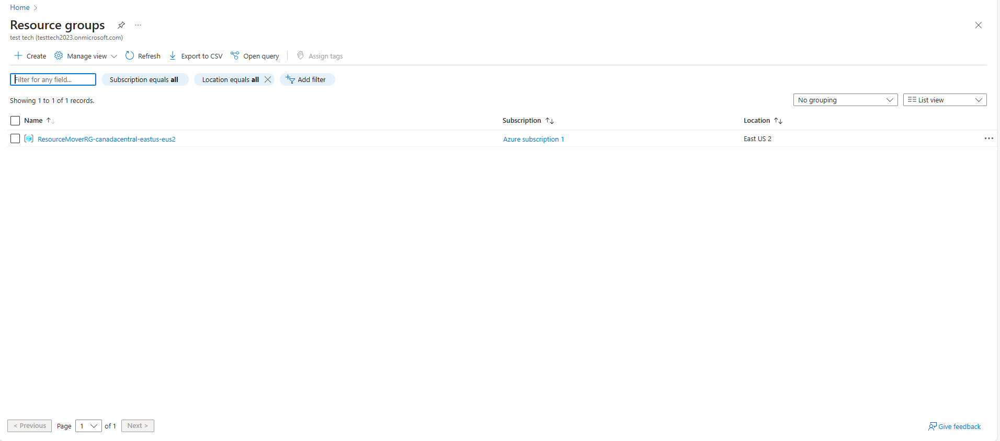
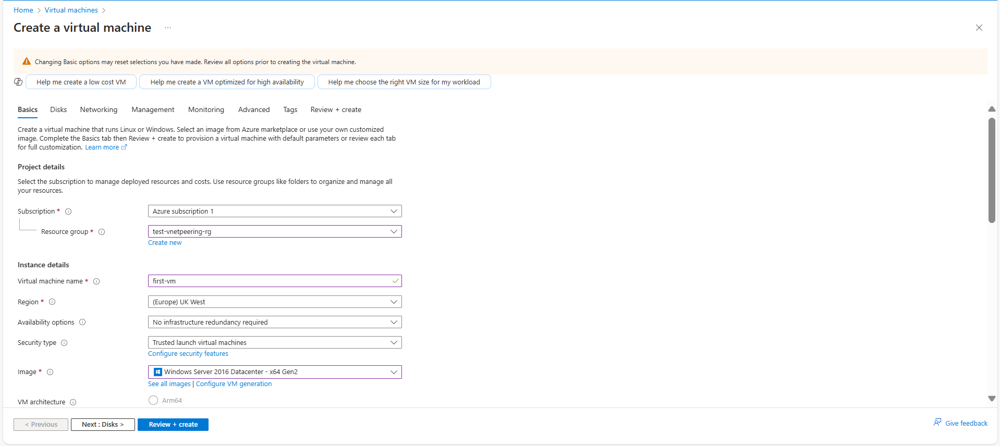
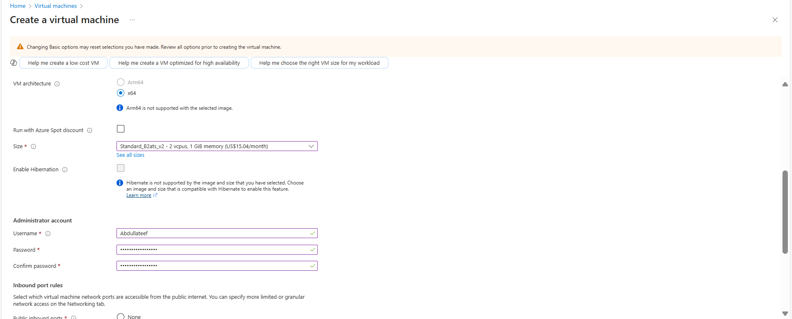
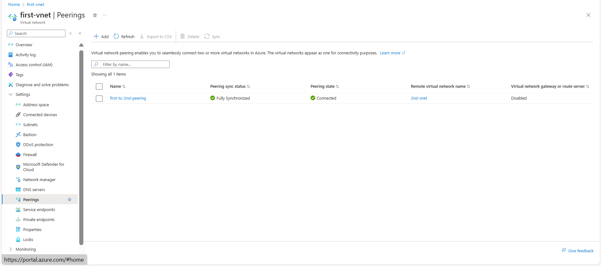
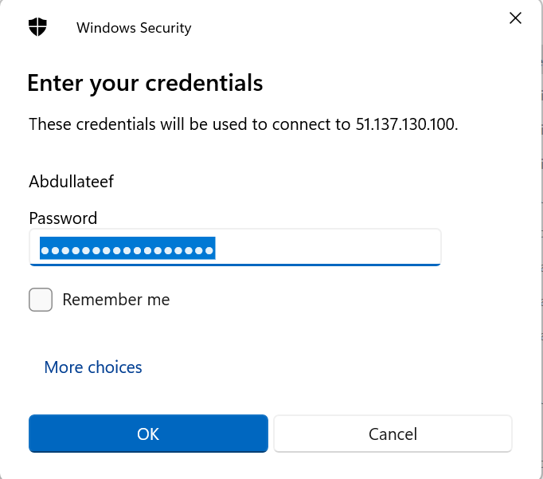

# Establish connectivity between two virtual machines in different Virtual Network using Virtual Network Peering and their Private IP addresses
Virtual network peering in Azure enables seamless connectivity between two or more virtual networks. It allows resources in one virtual network to communicate with resources in another, facilitating data transfer across different Azure subscriptions, Microsoft Entra tenants, deployment models, and regions.

When virtual networks are connected within the same region, this is referred to as Virtual Network Peering. When the networks span across different regions, it is known as Global Virtual Network Peering.

In this walkthrough, I’ll guide you through the process of setting up Virtual Network Peering and establishing connectivity between two virtual machines located in separate virtual networks.

### Task 1: Create a Resource Group

1.	Sign in to the [Azure Portal](https://portal.azure.com).

2. In the **search bar**, type **Resource Groups** and select it from the results.

3. Click Create to create a new resource group

4. Select the appropriate **subscription**

5. Enter a **name** for the resource group (test-vnetpeering-rg). **Use lowercase letters as per Azure naming conventions.**

6. Click **Review + Create**, then click **Create** to deploy the resource group.

### Task 2: Create Two Virtual Networks (VNets)

#### Create the First Virtual Network (first-vnet)
7. In the **Azure Portal**, search for **Virtual Networks** and select it.
8. Click **Create.**

9. Enter the required details:
    - **Subscription:** Select the same subscription as the resource group.
    - **Resource Group:** Select test-vnetpeering-rg.
    - **Virtual Network Name:** first-vnet.
    - **Region:** UK-West

10. In the IP Addressing section, configure the CIDR block (10.0.0.0/22).

11.	Click **Review + Create**

12.	Click **Create** to deploy the first virtual network.
#### Create the Second Virtual Network (second-vnet)

13. Repeat **steps 7–12**, but name this network **2nd-vnet** and use the same **CIDR block** (/22).

### Task 3: Create Virtual Machines in Each Virtual Network
#### Create First Virtual Machine (first-vm in first-vnet)

14. In the **Azure Portal**, search for **Virtual Machines** and select it.

15. Click **Create → Azure Virtual Machine**.

16. Enter the required details:
    - **Subscription:** Select the same subscription as before.
    - **Resource Group:** Select test-vnetpeering-rg.
    - **Virtual Machine Name:** first-vm.
    - **Region:** Same as first-vnet.
    - **Image:** Select your preferred OS (Windows Server 2022).
    - **Size:** Choose an appropriate VM size.
    - **Authentication:** Provide a username and password. *(NB: please keep this information as you would be required to provide the information when you want to connect to your vm)*

17.	Under **Networking**, select
    - **Virtual Network:** first-vnet.
    - **Subnet:** Choose a subnet within first-vnet.
    - **Public IP:** Create new IP  *(since we would be connecting to the first vm using a public IP).*

18. Click **Review + Create**, then **Create** to deploy the VM.
#### Create Second Virtual Machine (2nd-vm in 2nd-vnet)

19. Repeat **steps 14–18**, but name this VM **2nd-vm** and place it in **2nd-vnet**.

20. Set Public IP to **None** *(since we are using private IP for peering)*

### Task 4: Configure Virtual Network Peering
#### Create Peering from first-vnet to 2nd-vnet
20. In the **Azure Portal**, search for **Virtual Networks** and select it.
21.	Click on **first-vnet.**
22.	In the left pane, go to **Settings → Peerings.**
23.	Click **+ Add** to create a new peering.
24.	Configure the peering:
    - **Peering Name:** first-to-2nd-peering.
    - **Peer Virtual Network:** Select second-vnet.
    - **Allow Traffic:** Ensure "Allow virtual network access" is enabled.
    - **Allow Forwarded Traffic:** Enable.
    - **Allow Gateway Transit:** Deactivate.
25.	Click **Add** to establish the peering. Ensure the peering is fully synchronized
  
   	

### Task 5: Test Connectivity Between VMs
#### Connect to first-vm and test connection to second-vm (Enable RDP Between VMs)
28. In the **Azure Portal**, navigate to **Virtual Machines** and select first-vm.
29.	Click **Connect → RDP** and download the RDP file.
   
   	
31. Open the **RDP file**, enter your **username and password**, then click **OK** to connect.
    
    
33.	On first-vm, open **Remote Desktop Connection**, enter second-vm's **private IP (10.0.1.4)**, and connect.
    
   	

**Summary**

✅ **Resource group created**

✅ **Two VNets created (first-vnet and second-vnet)**

✅ **Two VMs created (first-vm and second-vm)**

✅ **VNet Peering established**

✅ **Private connectivity between VMs verified**

    

