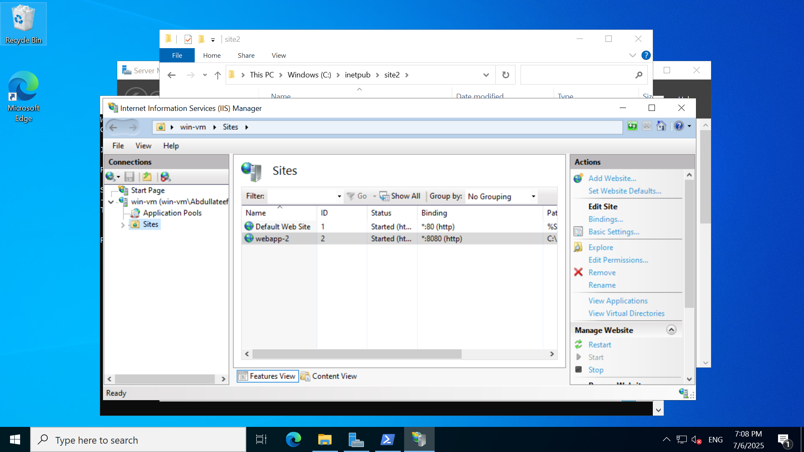

# JOURNAL.md

## 🧾 Deployment Journal – Windows VM Web Server on Azure

This journal documents the real-world experience, challenges, and observations during the deployment of a Windows VM in Azure, used to host two IIS-based websites on different ports.

---

## ✅ Initial Setup Steps

- Created a Virtual Network `webapp-test-vnet` with address space `10.0.0.0/22` and subnet `10.0.0.0/24`.  
- Created two Application Security Groups (ASG):  
  - `win-vm-asg` for the Windows VM  
  - `lin-vm-asg` for a potential Linux VM  
- Deployed a Windows Server 2022 VM named `win-vm` with:  
  - Public IP  
  - Inbound ports: RDP, HTTP, HTTPS  
  - Subnet: `default`

---

## 🌐 Web Server Configuration

- Installed IIS on the VM using:

  ```powershell
  Install-WindowsFeature -name Web-Server -IncludeManagementTools
  ```

- Confirmed IIS was installed by visiting the VM's public IP in a browser.

- Navigated to `C:\inetpub\wwwroot`, deleted default `iisstart.htm`, and replaced with a custom site.
- Confirmed website served successfully on port 80.

---

## 🔄 NSG and ASG Testing

- Attached `win-vm-asg` to the VM under **Networking > Application Security Groups**.
- After applying ASG, lost access to the web server.

### 🛑 Issue Faced

- NSG rule incorrectly used the **public IP** of the VM as the destination.
- This blocked traffic even though port 80 was open.

### 🛠️ Resolution

- Updated the NSG rule:
  - Changed **Destination** to use the **private IP address** or **CIDR** of the VM.
  - Access was restored.

✅ Website loading restored after adjusting NSG rule.

---

## 🔐 NSG and ASG Configuration – Lessons and Corrections

### 🎯 Intent

I aimed to improve security by using **Application Security Groups (ASG)** and by restricting **NSG rules** to specific IPs and sources, including:

- Replacing source `Any` with ASG.
- Using the VM's **private IP** as the destination.
- Restricting **RDP** to my own public IP.
  

### 🛠️ What I Did

1. Attached `win-vm-asg` to the VM via:
   - **VM > Networking > Network Interface > Application Security Groups**

2. Modified the NSG to restrict access:
   - Allowed HTTP (80), HTTPS (443) only from the ASG
   - Allowed RDP (3389) **only from my public IP**
   - Denied all other inbound traffic by default
     

| Priority | Name                  | Port | Protocol | Source     | Destination | Action |
|----------|-----------------------|------|----------|------------|-------------|--------|
| 100      | AllowWebASG_HTTP      | 80   | TCP      | WebASG     | VM          | Allow  |
| 110      | AllowWebASG_HTTPS     | 443  | TCP      | WebASG     | VM          | Allow  |
| 120      | AllowMyIP_RDP         | 3389 | TCP      | MyPublicIP | VM          | Allow  |
| 65500    | DenyAllInBound        | *    | *        | *          | *           | Deny   |


### ❌ Mistakes and Realizations

#### 🚫 Problem 1: ASG for Public Access

Replacing `Source = Any` with `Source = WebASG` **broke public access** to my website. ASGs are meant for **internal Azure communication**, not public internet access.

#### 🚫 Problem 2: Public IP as Destination

I incorrectly used the **VM’s public IP** as the **Destination** in NSG rules, without CIDR format. This silently failed and blocked traffic.

### 🔍 Why This Was Wrong

- NSGs operate at the **VNet layer**, not at the public internet layer.
- Public IPs are **not valid destinations** for NSG rules.
- You must use the **private IP** of the VM (e.g., `10.0.0.4/32`) or the ASG the VM belongs to.
- Not using `/32` with the private IP causes Azure to **ignore or misinterpret** the rule.


### 🛠️ Resolutions Applied

1. Changed NSG rules to use:
   - `Source: Any` for public-facing HTTP/HTTPS
   - `Destination: Any` (or VM's private IP with `/32`) for port access
   - `Source: My Public IP` for RDP
2. Removed use of ASG as source for public-facing traffic.
3. Fixed destination format:
   - Used `10.0.0.4/32` instead of `10.0.0.4` or public IP.

### ✅ Final NSG Architecture Summary

**Inbound Rules:**

- ✅ Allow HTTP (80) from Internet or `Any`
- ✅ Allow HTTPS (443) from Internet or `Any`
- ✅ Allow RDP (3389) only from **my public IP**
- ❌ Removed open `Any → 3389`, `Any → 443`, `Any → 80`
- ✅ Retained default rule `DenyAllInbound` at priority `65500`

**Outbound Rules:**

- Default (allowed all) — left unchanged


### 🧠 Key Takeaways

- **ASG is for internal communication**, not external internet access.
- NSG "Destination" must use **private IPs in `/32` CIDR** format.
- Never use public IP as **destination** — NSG won't match it.
- NSGs **see traffic post-NAT**, so they only operate on **private IPs**.
- Always restrict RDP by **source IP**, not leave it open.


---

## 🌐 Hosting a Second Website on the Same VM (Port 8080)

### A. Create Second Website Folder

- Logged into the VM via RDP.
- Navigated to `C:\inetpub\`.
- Created a folder named `site2`.
- Copied the second website’s files into `site2`.

### B. Add Second Website in IIS

- Opened **IIS Manager**.
- Right-clicked **Sites** > **Add Website**.
- Provided the following values:
  - **Site Name**: `Site2`
  - **Physical Path**: `C:\inetpub\site2`
  - **Binding**:
    - **IP Address**: All Unassigned
    - **Port**: `8080`
    - **Host name**: *(left blank)*
- Clicked **OK** to create the second website.



---

## 🧪 Local Testing Inside the VM

- Accessed both sites from within the VM:
  - `http://localhost` → ✅ Website 1 loaded
  - `http://localhost:8080` → ✅ Website 2 loaded
- Confirmed both sites were active and IIS was properly configured.

---

## 🔍 Confirming Port Binding

Ran the following in PowerShell on the vm to verify the server was listening:

```powershell
netstat -ano | findstr :8080
```

Output showed:

```
TCP    0.0.0.0:8080      0.0.0.0:0     LISTENING     4  
TCP    [::]:8080         [::]:0        LISTENING     4
```

✅ Confirmed IIS was listening on port 8080 for both IPv4 and IPv6.


---

## ❌ External Access to Port 8080 Failed 

- Accessing `http://<public-ip>:8080` from the local browser failed in the local computer.
- Ran:

  ```powershell
  Test-NetConnection -ComputerName <public-ip> -Port 8080
  ```

  Got:

  ```
  TcpTestSucceeded : False
  ```

Indicated a network accessibility issue despite local success.


---

## 🧠 Troubleshooting Summary

| Area Checked          | Result                      |
|-----------------------|-----------------------------|
| IIS configuration     | ✅ Correct via localhost     |
| Port listening        | ✅ Confirmed with `netstat`  |
| Windows Firewall      | 🔄 Disabled (not the issue)  |
| Azure NSG             | 🛑 Suspected issue           |

---

## 🧩 Root Cause Found in NSG

The NSG had an inbound rule like:

| Field        | Value               |
|--------------|---------------------|
| Source       | Any                 |
| Destination  | VM Private IP `/32` ❌ |
| Port         | 8080                |
| Protocol     | TCP                 |
| Action       | Allow               |

### ❗ Problem:

The NSG is attached to the NIC (public IP mapped to it). Restricting destination to private IP caused the rule to not match incoming traffic.

---

## 🛠️ Fix – Correct NSG Rule

Replaced the rule with:

| Field        | Value   |
|--------------|---------|
| Source       | Any     |
| Destination  | Any ✅   |
| Port         | 8080    |
| Protocol     | TCP     |
| Action       | Allow   |
| Priority     | 200     |

✅ NSG now allows public traffic to port 8080.

---

## ✅ Final Confirmation

- Re-ran:

  ```powershell
  Test-NetConnection <public-ip> -Port 8080
  ```

  Result:

  ```
  TcpTestSucceeded : True
  ```

  

- Opened `http://<public-ip>:8080` in browser — **Second website loaded successfully** 🎉

---

## 📌 Challenges Faced and How They Were Resolved

| Challenge                         | Solution                                |
|----------------------------------|------------------------------------------|
| Website not loading externally   | Verified local IIS config using localhost |
| Unsure if port was listening     | Used `netstat -ano`                      |
| Suspected Windows Firewall       | Confirmed it was off                     |
| NSG misconfiguration             | Fixed Destination = Any                  |
| No clear Azure error             | Used `Test-NetConnection` to isolate     |

---

## 🧠 Lessons Learned

- ✅ Start troubleshooting from the inside — local testing is powerful.
- ✅ NSG destination filtering can unintentionally block traffic.
- ✅ Use `netstat` to confirm port bindings.
- ✅ Use `Test-NetConnection` for remote port testing.
- ✅ Narrowing NSG rules too much may block expected traffic.

---

## 🚀 Next Steps

- Add host headers for domain-based routing instead of ports.
- Use HTTPS with Let's Encrypt or a custom certificate.
- Deploy Azure Front Door or Application Gateway for reverse proxy.
- Re-enable Windows Firewall and explicitly allow only required ports.

---

