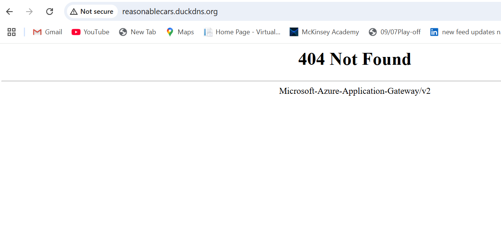
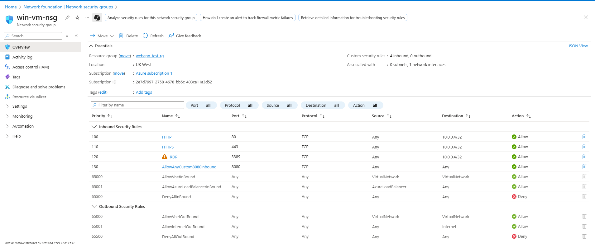
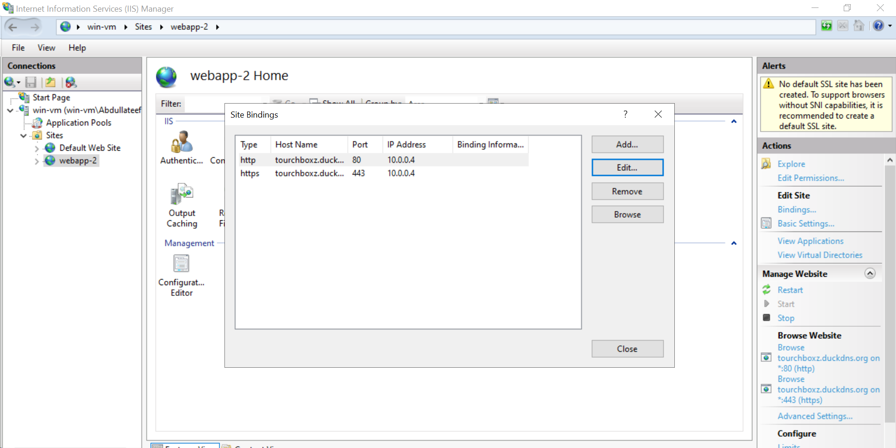

# JOURNAL.md

## 🧾 Deployment Journal – Windows VM Web Server on Azure

This journal documents the real-world experience, challenges, and observations during the deployment of a Windows VM in Azure, used to host two IIS-based websites on different ports.

---

## ✅ Initial Setup Steps

- Created a Virtual Network `webapp-test-vnet` with address space `10.0.0.0/22` and subnet `10.0.0.0/24`.  
- Created two Application Security Groups (ASG):  
  - `win-vm-asg` for the Windows VM  
  - `lin-vm-asg` for a potential Linux VM  
- Deployed a Windows Server 2022 VM named `win-vm` with:  
  - Public IP  
  - Inbound ports: RDP, HTTP, HTTPS  
  - Subnet: `default`

---

## 🌐 Web Server Configuration

- Installed IIS on the VM using:

  ```powershell
  Install-WindowsFeature -name Web-Server -IncludeManagementTools
  ```

- Confirmed IIS was installed by visiting the VM's public IP in a browser.

- Navigated to `C:\inetpub\wwwroot`, deleted default `iisstart.htm`, and replaced with a custom site.
- Confirmed website served successfully on port 80.

---

## 🔄 NSG and ASG Testing

- Attached `win-vm-asg` to the VM under **Networking > Application Security Groups**.
- After applying ASG, lost access to the web server.

### 🛑 Issue Faced

- NSG rule incorrectly used the **public IP** of the VM as the destination.
- This blocked traffic even though port 80 was open.

### 🛠️ Resolution

- Updated the NSG rule:
  - Changed **Destination** to use the **private IP address** or **CIDR** of the VM.
  - Access was restored.

✅ Website loading restored after adjusting NSG rule.

---

## 🔐 NSG and ASG Configuration – Lessons and Corrections

### 🎯 Intent

I aimed to improve security by using **Application Security Groups (ASG)** and by restricting **NSG rules** to specific IPs and sources, including:

- Replacing source `Any` with ASG.
- Using the VM's **private IP** as the destination.
- Restricting **RDP** to my own public IP.
  

### 🛠️ What I Did

1. Attached `win-vm-asg` to the VM via:
   - **VM > Networking > Network Interface > Application Security Groups**

2. Modified the NSG to restrict access:
   - Allowed HTTP (80), HTTPS (443) only from the ASG
   - Allowed RDP (3389) **only from my public IP**
   - Denied all other inbound traffic by default
     

| Priority | Name                  | Port | Protocol | Source     | Destination | Action |
|----------|-----------------------|------|----------|------------|-------------|--------|
| 100      | AllowWebASG_HTTP      | 80   | TCP      | WebASG     | VM          | Allow  |
| 110      | AllowWebASG_HTTPS     | 443  | TCP      | WebASG     | VM          | Allow  |
| 120      | AllowMyIP_RDP         | 3389 | TCP      | MyPublicIP | VM          | Allow  |
| 65500    | DenyAllInBound        | *    | *        | *          | *           | Deny   |


### ❌ Mistakes and Realizations

#### 🚫 Problem 1: ASG for Public Access

Replacing `Source = Any` with `Source = WebASG` **broke public access** to my website. ASGs are meant for **internal Azure communication**, not public internet access.

#### 🚫 Problem 2: Public IP as Destination

I incorrectly used the **VM’s public IP** as the **Destination** in NSG rules, without CIDR format. This silently failed and blocked traffic.

### 🔍 Why This Was Wrong

- NSGs operate at the **VNet layer**, not at the public internet layer.
- Public IPs are **not valid destinations** for NSG rules.
- You must use the **private IP** of the VM (e.g., `10.0.0.4/32`) or the ASG the VM belongs to.
- Not using `/32` with the private IP causes Azure to **ignore or misinterpret** the rule.


### 🛠️ Resolutions Applied

1. Changed NSG rules to use:
   - `Source: Any` for public-facing HTTP/HTTPS
   - `Destination: Any` (or VM's private IP with `/32`) for port access
   - `Source: My Public IP` for RDP
2. Removed use of ASG as source for public-facing traffic.
3. Fixed destination format:
   - Used `10.0.0.4/32` instead of `10.0.0.4` or public IP.

### ✅ Final NSG Architecture Summary

**Inbound Rules:**

- ✅ Allow HTTP (80) from Internet or `Any`
- ✅ Allow HTTPS (443) from Internet or `Any`
- ✅ Allow RDP (3389) only from **my public IP**
- ❌ Removed open `Any → 3389`, `Any → 443`, `Any → 80`
- ✅ Retained default rule `DenyAllInbound` at priority `65500`

**Outbound Rules:**

- Default (allowed all) — left unchanged


### 🧠 Key Takeaways

- **ASG is for internal communication**, not external internet access.
- NSG "Destination" must use **private IPs in `/32` CIDR** format.
- Never use public IP as **destination** — NSG won't match it.
- NSGs **see traffic post-NAT**, so they only operate on **private IPs**.
- Always restrict RDP by **source IP**, not leave it open.


---

## 🌐 Hosting a Second Website on the Same VM (Port 8080)

### A. Create Second Website Folder

- Logged into the VM via RDP.
- Navigated to `C:\inetpub\`.
- Created a folder named `site2`.
- Copied the second website’s files into `site2`.

### B. Add Second Website in IIS

- Opened **IIS Manager**.
- Right-clicked **Sites** > **Add Website**.
- Provided the following values:
  - **Site Name**: `Site2`
  - **Physical Path**: `C:\inetpub\site2`
  - **Binding**:
    - **IP Address**: All Unassigned
    - **Port**: `8080`
    - **Host name**: *(left blank)*
- Clicked **OK** to create the second website.


---

## 🧪 Local Testing Inside the VM

- Accessed both sites from within the VM:
  - `http://localhost` → ✅ Website 1 loaded
  - `http://localhost:8080` → ✅ Website 2 loaded
- Confirmed both sites were active and IIS was properly configured.

---

## 🔍 Confirming Port Binding

Ran the following in PowerShell on the vm to verify the server was listening:

```powershell
netstat -ano | findstr :8080
```

Output showed:

```
TCP    0.0.0.0:8080      0.0.0.0:0     LISTENING     4  
TCP    [::]:8080         [::]:0        LISTENING     4
```

✅ Confirmed IIS was listening on port 8080 for both IPv4 and IPv6.


---

## ❌ External Access to Port 8080 Failed 

- Accessing `http://<public-ip>:8080` from the local browser failed in the local computer.
- Ran:

  ```powershell
  Test-NetConnection -ComputerName <public-ip> -Port 8080
  ```

  Got:

  ```
  TcpTestSucceeded : False
  ```

Indicated a network accessibility issue despite local success.


---

## 🧠 Troubleshooting Summary

| Area Checked          | Result                      |
|-----------------------|-----------------------------|
| IIS configuration     | ✅ Correct via localhost     |
| Port listening        | ✅ Confirmed with `netstat`  |
| Windows Firewall      | 🔄 Disabled (not the issue)  |
| Azure NSG             | 🛑 Suspected issue           |

---

## 🧩 Root Cause Found in NSG

The NSG had an inbound rule like:

| Field        | Value               |
|--------------|---------------------|
| Source       | Any                 |
| Destination  | VM Private IP `/32` ❌ |
| Port         | 8080                |
| Protocol     | TCP                 |
| Action       | Allow               |

### ❗ Problem:

The NSG is attached to the NIC (public IP mapped to it). Restricting destination to private IP caused the rule to not match incoming traffic.

---

## 🛠️ Fix – Correct NSG Rule

Replaced the rule with:

| Field        | Value   |
|--------------|---------|
| Source       | Any     |
| Destination  | Any ✅   |
| Port         | 8080    |
| Protocol     | TCP     |
| Action       | Allow   |
| Priority     | 200     |

✅ NSG now allows public traffic to port 8080.

---

## ✅ Final Confirmation

- Re-ran:

  ```powershell
  Test-NetConnection <public-ip> -Port 8080
  ```

  Result:

  ```
  TcpTestSucceeded : True
  ```

  

- Opened `http://<public-ip>:8080` in browser — **Second website loaded successfully** 🎉

---

## 📌 Challenges Faced and How They Were Resolved

| Challenge                         | Solution                                |
|----------------------------------|------------------------------------------|
| Website not loading externally   | Verified local IIS config using localhost |
| Unsure if port was listening     | Used `netstat -ano`                      |
| Suspected Windows Firewall       | Confirmed it was off                     |
| NSG misconfiguration             | Fixed Destination = Any                  |
| No clear Azure error             | Used `Test-NetConnection` to isolate     |

---

## 🧠 Lessons Learned

- ✅ Start troubleshooting from the inside — local testing is powerful.
- ✅ NSG destination filtering can unintentionally block traffic.
- ✅ Use `netstat` to confirm port bindings.
- ✅ Use `Test-NetConnection` for remote port testing.
- ✅ Narrowing NSG rules too much may block expected traffic.

---

## 🌐 Adding DNS and Application Gateway to Support Multiple IIS Websites

### 🎯 Objective
Extend the existing IIS setup (two websites on a single Azure VM) by:
- Assigning **custom domain names** using a free DNS provider
- Deploying **Azure Application Gateway** to route based on domain names (host headers)
- Removing port-based access (e.g. `:8080`) and using only `http://domain.com`

---

## 🔧 DNS Setup Using DuckDNS

1. Visited [DuckDNS](https://www.duckdns.org) to register free dynamic DNS entries.
2. Created two subdomains:
   - `reasonablecars.duckdns.org` → for Website 1
   - `tourchboxz.duckdns.org` → for Website 2
3. Both domains point to the **public IP of the Application Gateway**.

📝 Note: DuckDNS does not allow appending ports in the DNS record — which is why Application Gateway was used.

---

## 🚪 IIS Configuration: Switch to Host Header-Based Binding

Updated both websites in **IIS Manager**:
- Set **Binding Port**: `80` (both sites)
- Added **Host Name**:
  - Website 1 → `reasonablecars.duckdns.org`
  - Website 2 → `tourchboxz.duckdns.org`

❗ IIS warned that only one site can bind to port 80 without a hostname — this was resolved by binding each site to **port 80 with a unique host header**.

---

## 🛠️ Azure Application Gateway Configuration

### 1. Listener Setup
- Listener Type: **Multi-site**
- Frontend Port: `80`
- Hostnames:
  - Listener 1: `reasonablecars.duckdns.org`
  - Listener 2: `tourchboxz.duckdns.org`

### 2. Backend Pool
- Target: Private IP of the VM → `10.0.0.4`
- Both listeners share the same backend pool (VM IP)

### 3. Backend Settings
- Protocol: HTTP
- Port: `80`
- **Override with specific hostname**: ✅ Yes
  - Backend setting 1 → `reasonablecars.duckdns.org`
  - Backend setting 2 → `tourchboxz.duckdns.org`

### 4. Routing Rules
- Rule 1: If host header = `reasonablecars.duckdns.org` → send to `reasonablecars` backend setting
- Rule 2: If host header = `tourchboxz.duckdns.org` → send to `tourchboxz` backend setting

---

## 🧪 Testing and Errors Faced

### ❌ Initial Issue: 502 Bad Gateway

- Both websites returned `502 Bad Gateway` from Application Gateway.
- Backend health probes were failing with:
  > Received invalid status code: 404

#### 🔍 Root Cause:
- Health probe expected HTTP 200–399 but backend sites were responding with 404.
- IIS sites were not handling requests without the proper `Host` header.

### ✅ Fix Implemented
- In **Application Gateway backend settings**, enabled:
  - **Override with specific domain name** = `reasonablecars.duckdns.org` / `tourchboxz.duckdns.org`

This ensured the App Gateway sent the correct `Host` header to IIS.

---

## ✅ Final Results

- `http://reasonablecars.duckdns.org` now loads Website 1
- `http://tourchboxz.duckdns.org` now loads Website 2
- No more need to use ports like `:8080`
- Application Gateway successfully routes based on **hostnames**

---

## 🧠 Lessons Learned

- **Application Gateway** is essential for hostname-based routing on one VM.
- Both IIS sites can use **port 80** when they use **distinct host headers**.
- Health probes must return 200–399 to be marked healthy.
- Use `Override with specific domain name` when the backend site depends on `Host` headers.

---

## 🚀 Next Steps

- Add HTTPS support using SSL certificates (e.g. via Let's Encrypt)
- Try Azure DNS instead of DuckDNS for more control
- Automate deployment with ARM/Bicep or Terraform

---

## 🛠️ Journal Entry: Resizing the VM and Fixing App Gateway 404 Error

<details>
<summary>⚠️ Issue after VM Resize — Websites stopped responding</summary>


After resizing the Windows VM to reduce cost, I noticed both websites (`reasonablecars.duckdns.org` and `tourchboxz.duckdns.org`) returned the following error:





### 🔍 Initial Diagnostics

- **VM private IP remained the same:** `10.0.0.4`
- **App Gateway backend health:** ✅ *Healthy*
- **Connection Troubleshoot** from App Gateway to VM returned:


NSG Settings: Rules were correctly allowing:

Port 80 → HTTP

Port 443 → HTTPS

Port 8080 (for test site)

All to destination 10.0.0.4/32

 


</details> <details> <summary>✅ Resolution — IIS Binding Was Set to “All Unassigned”</summary>

  🧠 **Root Cause**

  
In IIS, both websites were bound to “All Unassigned”, meaning IIS was not explicitly listening on the VM’s private IP.
Azure Application Gateway expects the backend to respond on its exact IP (10.0.0.4).

🔧 Fix Applied
Open IIS Manager

For each site:

Go to Bindings

Edit the binding for HTTP and HTTPS

Change the IP address from All Unassigned → 10.0.0.4

Leave the hostname unchanged

Save and apply




🎉 **Outcome**
Websites started responding successfully

App Gateway routing was restored

No more 404 Not Found errors

</details>


