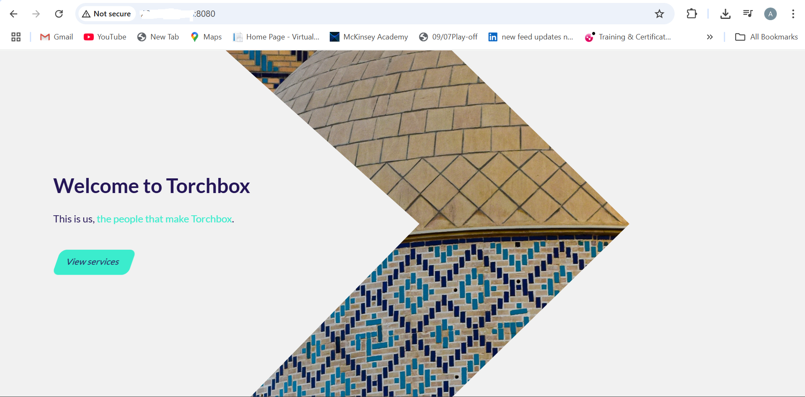

# Windows VM Web Server Deployment on Azure

This project demonstrates deploying a Windows Virtual Machine (VM) on Azure to host **two IIS-based websites**. It covers two major phases:

1. Hosting websites using **port-based access** (e.g., port 80 and 8080)
2. Transitioning to **host-based routing** using **Azure Application Gateway** and **custom DNS** from DuckDNS.

---

## 🚀 Phase 1: Hosting Two Websites with IIS and NSG Rules


### 🌐 1. Create Virtual Network (VNet)

| Setting              | Value                 |
|----------------------|-----------------------|
| **Name**             | `webapp-test-vnet`    |
| **Resource Group**   | `webapp-test-rg`      |
| **Region**           | `UK West`             |
| **Address Space**    | `10.0.0.0/22`         |
| **Subnet**           | `default (10.0.0.0/24)` |
| **Azure Bastion**    | Disabled              |
| **Azure Firewall**   | Disabled              |
| **Azure DDoS**       | Disabled              |

---

### 🔐 2. Create Application Security Groups (ASG)

| Name        | Region   | Resource Group     |
|-------------|----------|--------------------|
| win-vm-asg  | UK West  | webapp-test-rg     |
| lin-vm-asg  | UK West  | webapp-test-rg     |

---

### 💻 3. Create Windows Virtual Machine

| Setting                     | Value                         |
|-----------------------------|-------------------------------|
| **Name**                    | `win-vm`                      |
| **Region**                  | UK West                       |
| **Image**                   | Windows Server 2022 Datacenter (Gen2) |
| **Size**                    | Standard D2s v3 (2 vCPUs, 8 GB RAM) |
| **Username**                | Abdullateef                   |
| **Public IP**               | win-vm-ip                     |
| **Inbound Ports**           | RDP, HTTP, HTTPS              |
| **VNet/Subnet**             | `webapp-test-vnet / default`  |
| **Accelerated Networking**  | Enabled                       |
| **OS Disk Type**            | Standard HDD LRS              |
| **Boot Diagnostics**        | Enabled                       |
| **Backup / Site Recovery**  | Disabled                      |
| **Monitoring / Alerts**     | Disabled                      |

---

### 🛠️ 4. Configure Web Server (IIS)

#### A. Connect to the VM

1. Download the RDP file from the Azure portal.
2. Log in using the credentials set during deployment.

#### B. Install IIS via PowerShell

```powershell
Install-WindowsFeature -name Web-Server -IncludeManagementTools
```


#### C. Confirm IIS Is Running

1. Open a browser on your local machine.
2. Navigate to your VM’s **public IP**.
3. You should see the default IIS landing page.

#### D. Deploy Your First Website

1. Go to `C:\inetpub\wwwroot`
2. Remove the default files (including `iisstart.htm`)
3. Paste your own website files into the folder


---

### 🌐 5. Host a Second Website on the Same VM (Different Port)

#### A. Create Folder for Site 2

1. Navigate to `C:\inetpub\`
2. Create a new folder: `site2`
3. Paste the second website’s files into `site2`

#### B. Configure Second Website in IIS

1. Open **IIS Manager**
2. In the left panel, right-click **Sites** > **Add Website**
   - **Site Name**: `Site2`
   - **Physical Path**: `C:\inetpub\site2`
   - **Binding**:
     - **IP Address**: All Unassigned
     - **Port**: `8080`
     - **Host name**: *(leave blank)*
3. Click **OK** to create the site


---

### 🔒 6. Update NSG to Allow Port 8080

Create or update a rule in the NSG associated with your VM to allow traffic on port 8080.

| Field       | Value    |
|-------------|----------|
| **Source**  | Any      |
| **Destination** | Any |
| **Port**    | 8080     |
| **Protocol**| TCP      |
| **Action**  | Allow    |
| **Priority**| 200      |

✅ You should now be able to access your second website via:

```
http://<VM_Public_IP>:8080
```

---
## 📌 Summary for Phase 1

- VM hosts two websites on ports `80` and `8080`
- IIS used for configuration and managing web application
- NSG and ASG applied for network control
- Sites accessible publicly with correct ports

---
## 🌐 Phase 2: Use DNS + Azure Application Gateway (No More Ports!)

### 2️⃣ Both sites are reconfigured to share port 80, but are distinguished by hostnames:

- Changed both sites in IIS to use:
  - **Port**: `80`
  - **Host Name**:
    - Site 1: `reasonablecars.duckdns.org`
    - Site 2: `tourchboxz.duckdns.org`

- Both sites now listen on **port 80** but differentiate by **host header**.

---
## 3️⃣ Configure Azure Application Gateway (AppGW)

### 🔧 App Gateway Setup Overview

| Component         | Value                             |
|------------------|-----------------------------------|
| Listener Type     | Multi-site                        |
| Listener Hostnames| `reasonablecars.duckdns.org`, `tourchboxz.duckdns.org` |
| Backend Pools     | Target: VM Private IP (10.0.0.4)  |
| Backend Port      | `80`                              |
| Host Header       | Overridden with matching DNS name |
| Probes            | Default or Custom (200–399)       |

### ✅ DNS Setup

- Used [DuckDNS](https://www.duckdns.org/) to register 2 domains:
  - `reasonablecars.duckdns.org`
  - `tourchboxz.duckdns.org`
- Updated DNS to point to **Application Gateway's Public IP**

---
### 4️⃣ Final Architecture Summary

- 🔒 NSG rules restrict RDP access and allow port 80 only.
- IIS hosts 2 websites on port 80 using host headers
- NSG is open on port 80; RDP is restricted by source IP
- 🔁 Azure Application Gateway routes based on host headers handles Layer 7 routing
- 🌐 Both websites accessible via:
  - `http://reasonablecars.duckdns.org`
  - `http://tourchboxz.duckdns.org`
  

---

## ✅ Final Access URLs
- 🌍 http://reasonablecars.duckdns.org

- 🌍 http://tourchboxz.duckdns.org
## 🧠 Lessons Learned

- NSGs must be correctly configured for public traffic.
- App Gateway host header override is critical for IIS host-based binding.
- Default health probes must receive a 200 OK to pass.
- Test with:
  ```powershell
  curl -H "Host: tourchboxz.duckdns.org" http://localhost

---
## 📎 Resources

- [Microsoft Docs – Windows IIS](https://learn.microsoft.com/en-us/iis/)
- [Azure NSG Overview](https://learn.microsoft.com/en-us/azure/virtual-network/network-security-groups-overview)
- [Azure ASG Overview](https://learn.microsoft.com/en-us/azure/virtual-network/application-security-groups)

---

📝 For deployment challenges and troubleshooting notes, see [JOURNAL.md](./JOURNAL.md).
